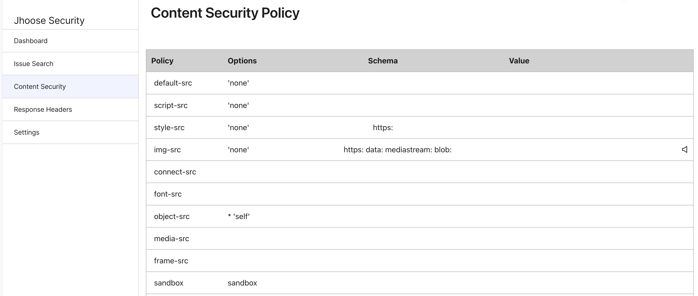
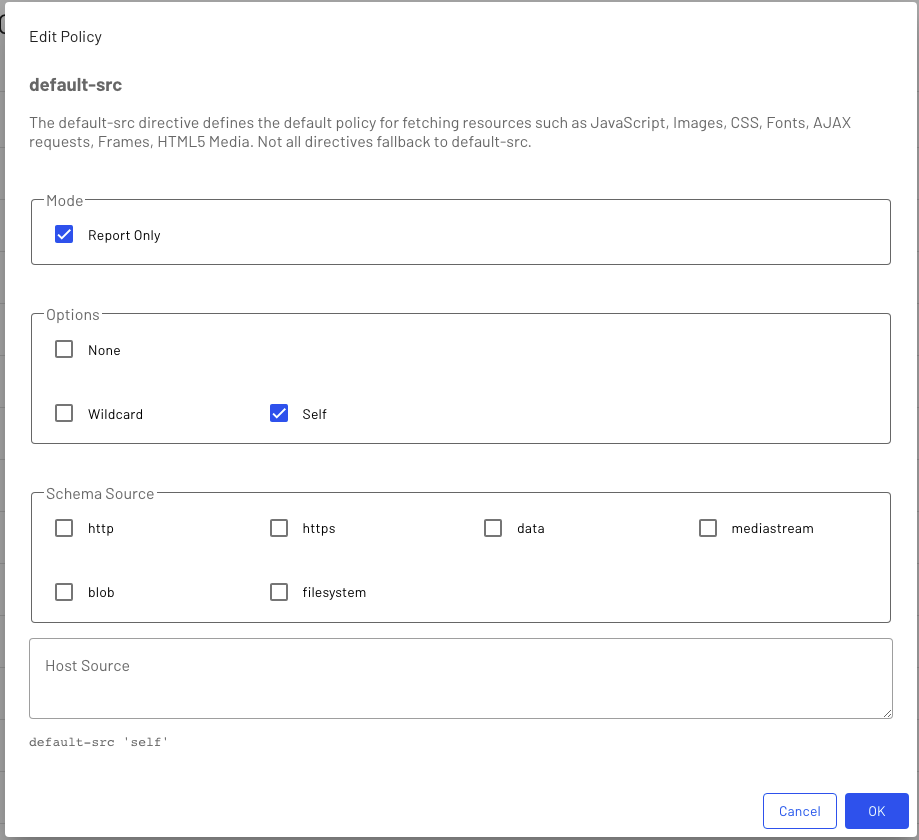

# Content Security Policy for Episerver

This repository contains an Episerver plugin to manage and deliver the content security policy for your site.

[](https://github.com/andrewmarkham/contentsecuritypolicy/actions/workflows/build-jhoose-security.yml)
[](https://github.com/andrewmarkham/contentsecuritypolicy/actions/workflows/build-jhoose-security-core.yml)


## Features

- Interface to manage policies.
- Global '*report only*' mode, or specify for each policy.
- Ability to specify paths which are excluded from outputting the policy header.
  
----

## Installation

Install the package directly from the Episerver Nuget repository.  This will install the admin interface along with the middleware to add the CSP header to the response.  

``` 
dotnet add package Jhoose.Security.Admin
```

## Configuration

*Startup.cs*
``` c#
services.AddJhooseSecurity(IConfiguration configuration, Action<SecurityOptions> options = null);
```

The `Action<SecurityOptions> options` is optional and if not specified then the default will be used.

``` json
  "JhooseSecurity": {
    "ExclusionPaths": [
      "/episerver"
    ]
  },
```

*ExclusionPaths:* Any request which starts with a path specified in this property will not include the CSP header.

``` c#
app.UseJhooseSecurity();
```

### Nonce tag helper
It is possible to get a nonce added to your inline `<script>` and `<style>` tags.

*_ViewImports.cshtml*
```
@addTagHelper *, Jhoose.Security.Core
```

``` html
<script nonce src="/assets/js/jquery.min.js"></script>
```

----

## Admin Interface







