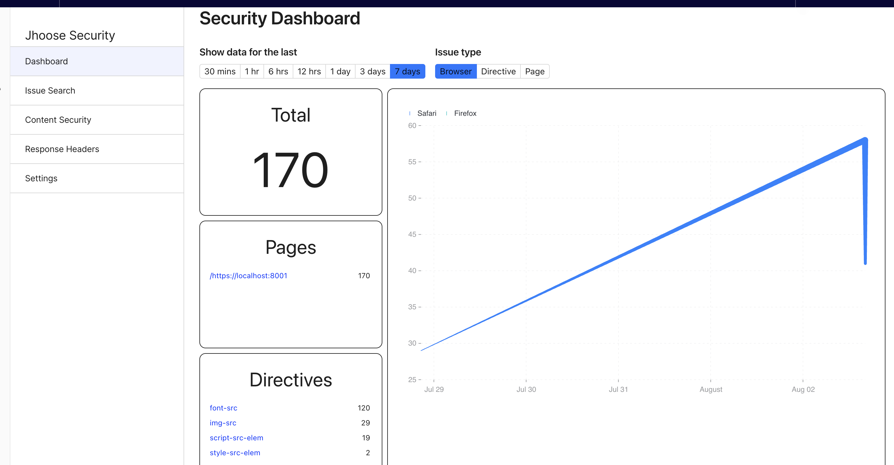
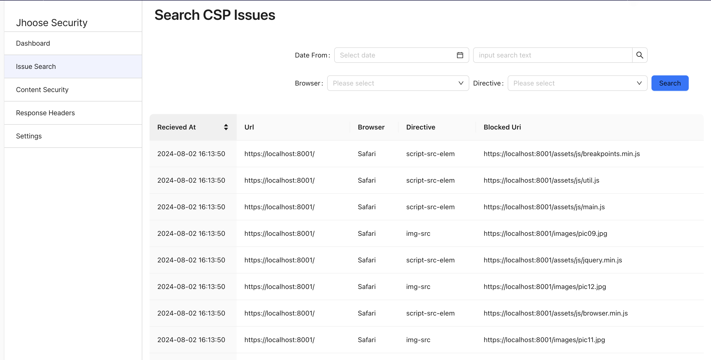
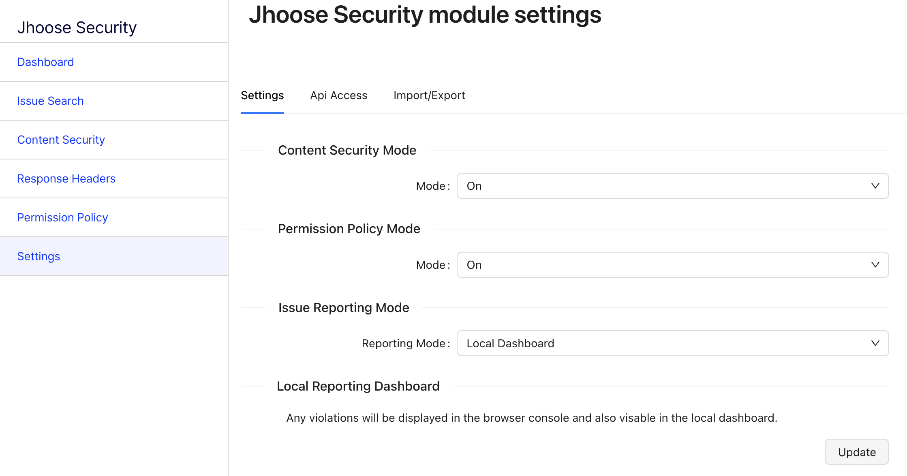
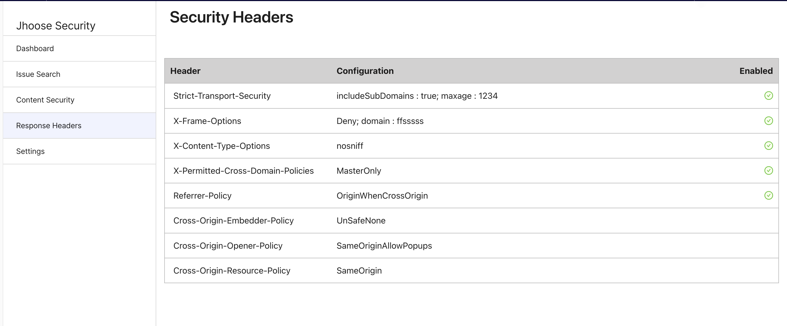

# Jhoose Security module for Optimizely

This module adds several security features to an Optimizely website.

 - User interface to manage the Content Secutiry Policy (CSP) policy for your site. 
 - Summary dashboard to monitor any ongoing CSP issues.
 - User interface to manage the Recommended Security headers and add to the response headers.

 This module fully supports
  - Optimizely 12, .NET (6.0-8.0) 
  - Episerver 11, .Net Framework 4.7.1 and Optimizely 12, .NET 5.0 [Legacy Documentation](./documentation/Legacy%20README.md)


[](https://github.com/andrewmarkham/contentsecuritypolicy/actions/workflows/build-jhoose-security.yml)

## Installation

Install the package directly from the Optimizley Nuget repository.  

``` 
dotnet add package Jhoose.Security.Admin
```

```
Install-Package Jhoose.Security.Admin
```

###Dependencies
The module requires the compatability level of the database to be >= 130
----

## Content Security Policy

- Interface to manage policies.
- Global '*report only*' mode, or specify for each policy.
- Ability to specify paths which are excluded from outputting the policy header.
  
Review the [Admin Interface](./documentation/admin-interface.md) documentation for more detail on how to manage the policies.

### Configuration

*Startup.cs*
``` c#
using Jhoose.Security.DependencyInjection;
...
services.AddJhooseSecurity(_configuration);
```

The `Action<SecurityOptions> options` is optional and if not specified then the default will be used.

``` json
  "JhooseSecurity": {
    "ExclusionPaths": [
      "/episerver"
    ]
  },
```

*ExclusionPaths:* Any request which starts with a path specified in this property will not include the CSP header.

``` c#
app.UseJhooseSecurity();
```

#### Nonce tag helper
It is possible to get a nonce added to your inline `<script>` and `<style>` tags.

*_ViewImports.cshtml*
```
@addTagHelper *, Jhoose.Security.Core
```

``` html
<script nonce src="/assets/js/jquery.min.js"></script>
```

### Issue Dashboard
The issue dashboard shows a summary of any ongoing Content Security errors being raised by the site. 

The dashboard will list the top 5 pages and top 5 directives that are reporting issues on the site.

By default only issues for the last 30 minutes will be shown, but this can be increased all the way upto the last 7 days.



More indepth investigation can be done via the search interface.


#### Data & Data Retention
By default data will only be kept for the last 30 days, but this can be modified via the settings.

There is a scheduled job `Purge Jhoose Security Reporting Data` this must be ran to remove any legacy data.

By default all data is stored in a custom SQL table.  This is added to the CMS database, but this can be changed by setting the connection string setting.

There is also an option to store the data within an Elastic Search Database.  This can be configured within the settings.

It is also possible to create your own [custom provider](./documentation/dashboard.md#custom-provider) and store the data in any external repository. 

#### Configuration

[More Configuration options](./documentation/dashboard.md)

To enable this feature the the Issue Reporting Mode to **Local Dashboard**




## Recommended Security Headers

The following recommended security headers are now automatically added to the response header.

The headers can be managed directly via configuration, or via a user interface.

```
Strict-Transport-Security: max-age=31536000;
X-Frame-Options: deny
X-Content-Type-Options: nosniff
X-Permitted-Cross-Domain-Policies: none
Referrer-Policy: strict-origin-when-cross-origin
Cross-Origin-Embedder-Policy: require-corp
Cross-Origin-Opener-Policy: same-origin
Cross-Origin-Resource-Policy: same-origin
```

The following headers are automatically removed
```
X-Powered-By: 
X-AspNet-Version: 
X-AspNetMvc-Version: 
```

The following headers cannot be removed programatically, but information about how to modify the web.config is contained below.

```
X-Powered-By: 
Server: 
```

### User Interface
When the user interface is enabled, the options set by the configuration method are ignored.

``` c#
services.AddJhooseSecurity(_configuration, (o) =>
{
    o.UseHeadersUI = true;
});
```



### Configuration

If you want to manage the headers via configuration then you will need to disable the interface first.

The values can be set using appSettings.json, or directly in the startup using the  SecurityOptions class.

``` c#
services.AddJhooseSecurity(_configuration, (o) =>
{
    o.UseHeadersUI = false;
    o.XFrameOptions.Mode = Jhoose.Security.Core.Models.SecurityHeaders.XFrameOptionsEnum.SameOrigin;
});
```

``` json
"JhooseSecurity": {
   "HttpsRedirection":true,
   "StrictTransportSecurity":{
      "MaxAge":31536000,
      "IncludeSubDomains":true
   },
   "XFrameOptions":{
      "Enabled": true,
      "Mode":0,
      "Domain":""
   },
   "XPermittedCrossDomainPolicies":{
      "Mode":0
   },
   "ReferrerPolicy":{
      "Mode":0
   },
   "CrossOriginEmbedderPolicy":{
      "Mode":1
   },
   "CrossOriginOpenerPolicy":{
      "Mode":2
   },
   "CrossOriginResourcePolicy":{
      "Mode":1
   }
}
```

#### Server Header and X-Powered-By Header
These aren't removed, the reason being
1. When hosting within Optimizley DXP, the CDN will obfuscate the server value anyway.
2. The approach is different depending on how you are hosintg your site.

##### Kestrel
``` c#
    // program.cs
    .ConfigureWebHostDefaults(webBuilder =>
    {
        webBuilder.ConfigureKestrel(o => o.AddServerHeader = false);
        webBuilder.UseStartup<Startup>();
    });
```

##### IIS 10
``` xml
<!-- web.config -->
<?xml version="1.0" encoding="UTF-8"?>
<configuration>
    <system.webServer>
        <security>
            <requestFiltering removeServerHeader="true" />
        </security>

        <httpProtocol>
            <customHeaders>
                <clear />
                <remove name="X-Powered-By" />
            </customHeaders>
        </httpProtocol>
    </system.webServer>
</configuration>
```

## Authentication
By default any user with the 'CmsAdmins' role can access the module, this can be changed at startup if you need to further restrict access.

``` C#
services.AddJhooseSecurity(_configuration,
    configurePolicy:   (p) =>
    {
        p.RequireRole("CspAdmin");
    });
```

## API Access
The security headers can be accessed via a Rest API, this is useful if you are using Optimizely to manage the content, but not presentation.

Access to the Rest API is secured by authentication keys, each consumer must include a valid key in the header.

Webhooks are used to notify any consumer that the security headrers have changed.

### Nonce value
Each request must include a 'nonce'.  This value should not be consistent and change between each request.

### Example

```
POST /api/jhoose/headers HTTP/1.1
Accept: application/json
Content-Type: application/json
X-API-Key: ...
{'nonce': '1234567890' }
```
 ---
 ## Version History

 |Version| Details|
 |:---|:---------------|
 |1.0|Initial Release|
 |1.1|Added Recommended Security Headers|
 |1.2|Ported to support Episerver 11 and .Net Framework 4.7.1<br/>Automatically remove (_X-AspNet-Version, X-AspNetMvc-Version_)|
 |1.3|Added .Net6 Support|
 |1.4|Included support for the Optimizely nonce service|
 |1.5|#64, #65 Resolved issue with duplicate headers being added and crashing the solution<br/>#70 Resolved issue the report-to directive being incorectly configured|
 |1.5.2|Add support for ws and wss protocols<br/>Add support for seperate report-uri and report-to endpoints|
 |2.0.0|Removed support for CMS 11/.Net Framework<br/>Added support for .NET7 and .NET8<br/>New  interface for managing security headers (#74)<br/>Fix issues #79, #80, #81 (Supports Readonly mode)|
 |2.1.0|Add ability to customise the access policy for the module<br/>Consistent serialization approach, ignores global settings|
 |2.2.0|API Access to Security headers|
 |2.2.1|Bug with the module not working when edit segment is different to the default 'episerver'.|
 |2.2.2|Bug with response header cache not being cleared after a change.|
 |2.3.0| Added a new Dashboard; this gives a summary of any current issues and also allows you to search for historical issues.<br/> UI refresh and various bug fixes  |
 |2.3.1| Bug fixes |
 |2.4.0| Added 'wasm-unsafe-eval' to the CSP Options<br/>Added missing options to default-src |
 |2.4.1| Make ICspProvider and IJhooseSecurityService request scoped so a unqiue dynamic nonce is generated per request |
 |2.4.2| Ensure CSP policy header syntax is valid when using 'None' Option for any policy |
 |2.5.0|Added Import / Export functionality<br/>Added support for .NET9<br/>Fixed minor UI bugs |