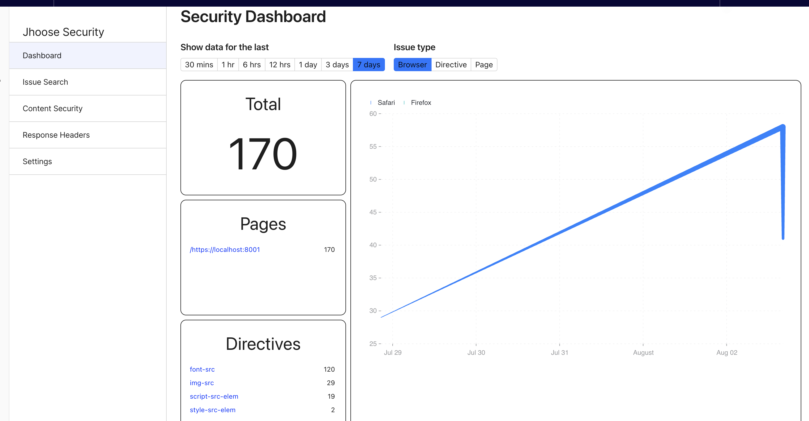
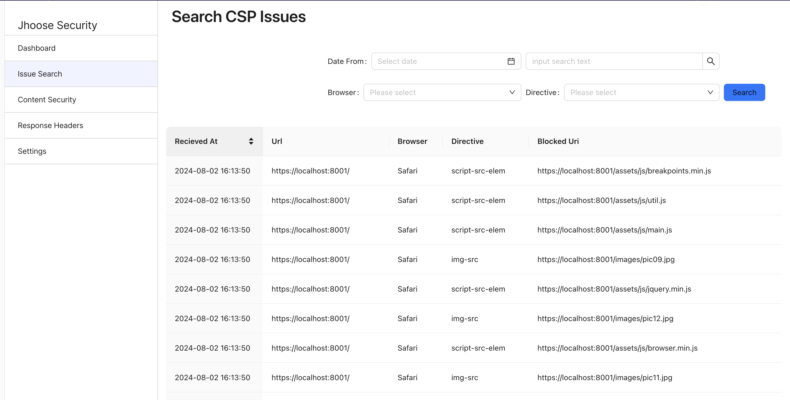
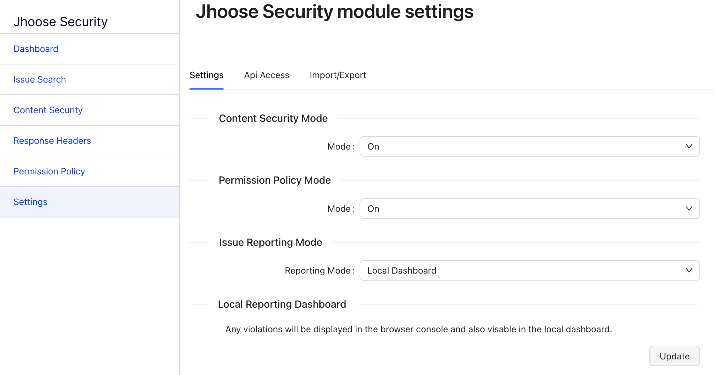
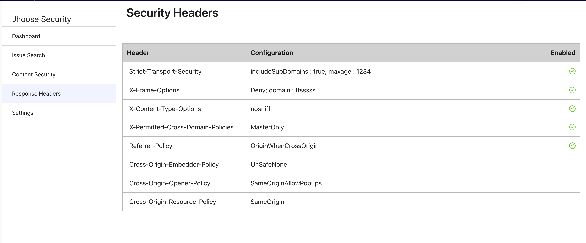

# Jhoose Security module for Optimizely

This module adds several security features to an Optimizely website.

 - User interface to manage the Content Secutiry Policy (CSP) policy for your site. 
 - Summary dashboard to monitor any ongoing CSP issues.
 - User interface to manage the Recommended Security headers and add to the response headers.
 - User interface to manage IP Restrictions - an IP allow-list, with path and header based bypasses.

 This module fully supports
  - Optimizely 13, .NET (10.0) (From version 3.1.0)
  - Optimizely 12, .NET (6.0-8.0) (Up to version 2.5.0)
  - Optimizely 12, .NET (8.0-10.0) (From version 2.6.0)
  - Episerver 11, .Net Framework 4.7.1 and Optimizely 12, .NET 5.0 [Legacy Documentation](./documentation/Legacy%20README.md)


[](https://github.com/andrewmarkham/contentsecuritypolicy/actions/workflows/build-jhoose-security.yml)

## Installation

Install the package directly from the Optimizely NuGet repository.  

``` bash
# To install CMS12
dotnet add package Jhoose.Security.Admin

# To install CMS13
dotnet add package Jhoose.Security.Admin13
```

``` bash
# To install CMS12
Install-Package Jhoose.Security.Admin

# To install CMS13
Install-Package Jhoose.Security.Admin13
```

### Upgrade to V3.0.0
If you are upgrading to version 3.x.x then please be aware that the database structure has changed.  You need to export your configuration before you upgrade, once complete you can then reimport the configuration.

### Dependencies

- The module requires the compatibility level of the database to be >= 130
- As of version 2.6.0 support of .NET6 and .NET7 has been removed.

----

## Content Security Policy

- Interface to manage policies.
- Global '*report only*' mode, or specify for each policy.
- Ability to specify paths which are excluded from outputting the policy header.
  
Review the [Admin Interface](./documentation/admin-interface.md) documentation for more details on how to manage the policies.

### Configuration

*Startup.cs*
``` c#
using Jhoose.Security.DependencyInjection;
...
services.AddJhooseSecurity(_configuration);
```

The `Action<SecurityOptions> options` is optional and if not specified then the default will be used.

``` json
  "JhooseSecurity": {
    "ExclusionPaths": [
      "/episerver",
      "/optimizely",
      "/api/jhoose"
    ]
  },
```

*ExclusionPaths:* Any request which starts with a path specified in this property will not include the CSP header. The default list covers the CMS edit-mode paths and this module's own admin UI/API - extend it if you install other admin modules (e.g. commerce management, a headless CMS UI, or third-party add-ons) whose paths should be treated the same way.

``` c#
app.UseJhooseSecurity();
```

#### Nonce tag helper
It is possible to get a nonce added to your inline `<script>` and `<style>` tags.

*_ViewImports.cshtml*
```
@addTagHelper *, Jhoose.Security.Core
```

``` html
<script nonce src="/assets/js/jquery.min.js"></script>
```

### Issue Dashboard
The issue dashboard shows a summary of any ongoing Content Security errors being raised by the site. 

The dashboard will list the top 5 pages and top 5 directives that are reporting issues on the site.

By default only issues for the last 30 minutes will be shown, but this can be increased all the way upto the last 7 days.



More indepth investigation can be done via the search interface.


#### Data & Data Retention
By default data will only be kept for the last 30 days, but this can be modified via the settings.

There is a scheduled job `Purge Jhoose Security Reporting Data` this must be ran to remove any legacy data.

By default all data is stored in a custom SQL table.  This is added to the CMS database, but this can be changed by setting the connection string setting.

There is also an option to store the data within an Elastic Search Database.  This can be configured within the settings.

It is also possible to create your own [custom provider](./documentation/dashboard.md#custom-provider) and store the data in any external repository. 

#### Configuration

[More Configuration options](./documentation/dashboard.md)

To enable this feature the the Issue Reporting Mode to **Local Dashboard**



### Page Level Overrides
Individual pages can override the site-wide CSP and Permissions Policy directives directly from the Optimizely on-page (all properties) editor, without having to go into the admin interface.

A page override takes priority over the site-wide policy, which in turn takes priority over the global default - so you only need to override the directives that should differ for that specific page.

Two toolbar commands are added to the editor:

- **Jhoose CSP Page Override** - add, edit or remove CSP directive overrides (including the `sandbox` directive) for the current page. Each directive is edited using the same options as the site-wide CSP editor (sources, schema sources, `report-only`, etc.).
- **Jhoose Permissions Policy Page Override** - add, edit or remove Permissions Policy overrides for the current page, using the same **Mode** (Default / Enabled / Enabled (Report Only) / Disabled), **Scope** (Self / All) and **Allowlist** options as the site-wide Permissions Policy editor.

Changes are only applied to the site once the dialog is saved (`OK`); closing or cancelling the dialog discards any unsaved changes.

## Recommended Security Headers

The following recommended security headers are now automatically added to the response header.

The headers can be managed directly via configuration, or via a user interface.

```
Strict-Transport-Security: max-age=31536000;
X-Frame-Options: deny
X-Content-Type-Options: nosniff
X-Permitted-Cross-Domain-Policies: none
Referrer-Policy: strict-origin-when-cross-origin
Cross-Origin-Embedder-Policy: require-corp
Cross-Origin-Opener-Policy: same-origin
Cross-Origin-Resource-Policy: same-origin
```

The following headers are automatically removed
```
X-Powered-By: 
X-AspNet-Version: 
X-AspNetMvc-Version: 
```

The following headers cannot be removed programatically, but information about how to modify the web.config is contained below.

```
X-Powered-By: 
Server: 
```

### User Interface
When the user interface is enabled, the options set by the configuration method are ignored.

``` c#
services.AddJhooseSecurity(_configuration, (o) =>
{
    o.UseHeadersUI = true;
});
```



### Configuration

If you want to manage the headers via configuration then you will need to disable the interface first.

The values can be set using appSettings.json, or directly in the startup using the  SecurityOptions class.

``` c#
services.AddJhooseSecurity(_configuration, (o) =>
{
    o.UseHeadersUI = false;
    o.XFrameOptions.Mode = Jhoose.Security.Core.Models.SecurityHeaders.XFrameOptionsEnum.SameOrigin;
});
```

``` json
"JhooseSecurity": {
   "HttpsRedirection":true,
   "StrictTransportSecurity":{
      "MaxAge":31536000,
      "IncludeSubDomains":true
   },
   "XFrameOptions":{
      "Enabled": true,
      "Mode":0,
      "Domain":""
   },
   "XPermittedCrossDomainPolicies":{
      "Mode":0
   },
   "ReferrerPolicy":{
      "Mode":0
   },
   "CrossOriginEmbedderPolicy":{
      "Mode":1
   },
   "CrossOriginOpenerPolicy":{
      "Mode":2
   },
   "CrossOriginResourcePolicy":{
      "Mode":1
   }
}
```

#### Server Header and X-Powered-By Header
These aren't removed, the reason being
1. When hosting within Optimizley DXP, the CDN will obfuscate the server value anyway.
2. The approach is different depending on how you are hosintg your site.

##### Kestrel
``` c#
    // program.cs
    .ConfigureWebHostDefaults(webBuilder =>
    {
        webBuilder.ConfigureKestrel(o => o.AddServerHeader = false);
        webBuilder.UseStartup<Startup>();
    });
```

##### IIS 10
``` xml
<!-- web.config -->
<?xml version="1.0" encoding="UTF-8"?>
<configuration>
    <system.webServer>
        <security>
            <requestFiltering removeServerHeader="true" />
        </security>

        <httpProtocol>
            <customHeaders>
                <clear />
                <remove name="X-Powered-By" />
            </customHeaders>
        </httpProtocol>
    </system.webServer>
</configuration>
```

## IP Restrictions

Restrict access to your site using an allow-list of IPv4/IPv6 addresses and CIDR ranges. Visitors whose address isn't on the effective list receive a `403 Forbidden` response.

The feature is managed from its own admin screen (**CMS > Security > IP Restrictions**) and is made up of three tabs:

- **IP Addresses** - the allow-list of individual IPs/CIDR ranges.
- **Ignored Paths** - path prefixes that bypass the allow-list check entirely.
- **Ignore Headers** - header name/value pairs that bypass the allow-list check entirely.

Every entry in all three tabs can be scoped either **globally** (applies to every site) or to **a single site** - use the site selector at the top of the screen to switch between them. Global and site-specific entries are additive: a site always sees the global entries *and* its own.

### Enabling the feature

IP Restriction enforcement is off by default. Turn it on either globally or per-site from the **IP Addresses** tab.

Unlike `ExclusionPaths` and `IpRestrictionScope` above, the mode itself (`IpRestrictionMode` / `IpRestrictionModesBySite`) is **not** part of `JhooseSecurityOptions` and cannot be set via `appsettings.json` - it's part of the module's settings record, stored in the database and managed entirely through the admin UI (or the [Import / Export](./documentation/admin-interface.md#import--export) feature, if you're scripting settings between environments). A site with no override falls back to the global mode.

### IP Addresses (allow-list)

Add one or more IPv4/IPv6 addresses or CIDR ranges (e.g. `203.0.113.10`, `198.51.100.0/24`). When the mode is `on` for a site, only requests originating from an address that matches an effective entry (global ∪ site-specific) are allowed through; everything else gets a `403`.

The client IP is resolved using the left-most entry in the `X-Forwarded-For` header when present, otherwise the connection's remote IP address. Only trust `X-Forwarded-For` if it is set by a proxy/load balancer you control - it can otherwise be spoofed by the caller.

### Ignored Paths

Path prefixes (e.g. `/healthz`, `/webhooks/stripe`) that are always allowed through, regardless of the caller's address or the allow-list mode. Matching is segment-aware (`/health` matches `/health/live` but not `/healthcheck`), and only affects IP Restriction - it has no effect on CSP, security headers or the Permissions Policy.

Useful for health checks, monitoring probes, and inbound webhooks that can't be pinned to a known IP.

### Ignore Headers

Header name/value pairs that are always allowed through, regardless of the caller's address. If an incoming request carries a header whose name and value match an effective entry (global ∪ site-specific), the allow-list check is bypassed for that request. Matching is case-insensitive on both the header name and value.

This is useful for trusted automation, internal services, or CI/CD systems that can attach a shared-secret-style header but can't be pinned to a stable IP.

Add entries from the **Ignore Headers** tab by entering a header name and value - multiple headers can be added, each scoped globally or to a specific site.

> Treat ignore-header values as secrets. Anyone who knows the header name/value pair can bypass the IP allow-list entirely, so use a long, random value and rotate it if it may have leaked.

### Scope - which parts of the site are protected

Configure `IpRestrictionScope` at startup to control which requests the allow-list applies to. Like `ExclusionPaths`, it's part of `JhooseSecurityOptions`, so it can be set either in code or via `appsettings.json`:

``` c#
services.AddJhooseSecurity(_configuration, (o) =>
{
    o.IpRestrictionScope = IpRestrictionScope.PublicSite;
});
```

``` json
"JhooseSecurity": {
  "IpRestrictionScope": "PublicSite"
}
```

| Value | Behaviour |
|:---|:---|
| `Off` | IP Restriction is bypassed entirely, regardless of the enable/disable mode configured in the admin UI. |
| `PublicSite` | The allow-list is enforced only for requests **outside** `ExclusionPaths` (i.e. the public-facing site). Requests to an excluded path are always allowed. |
| `CmsSite` | The allow-list is enforced only for requests **inside** `ExclusionPaths` (i.e. edit mode / the CMS UI). |
| `Both` *(default)* | The allow-list is enforced everywhere. |

`ExclusionPaths` is the same list used to exclude CSP, security headers and the Permissions Policy from a path (see [Configuration](#configuration) above) - it defaults to `["/episerver", "/optimizely", "/api/jhoose"]`, which covers CMS edit mode and this module's own admin UI/API out of the box.

**Important:** if you use `IpRestrictionScope.PublicSite`, requests to any path in `ExclusionPaths` (edit mode, this module's admin API, etc.) are always allowed through regardless of the caller's IP - which is what keeps the admin UI usable. If you install other admin modules with their own paths (e.g. commerce management, a headless CMS UI, or third-party add-ons), add them to `ExclusionPaths` too, otherwise they'll be treated as part of the public site and enforced against the allow-list:

``` c#
services.AddJhooseSecurity(_configuration, (o) =>
{
    o.ExclusionPaths.Add("/commercemanager");
    o.IpRestrictionScope = IpRestrictionScope.PublicSite;
});
```

If you instead use `IpRestrictionScope.CmsSite`, the reasoning flips: the allow-list is enforced *inside* `ExclusionPaths`, so anything you add there (including the defaults) becomes IP-restricted rather than exempt. Review the default list carefully in that mode - it's usually what you want to protect, not exclude.

### Order of evaluation

For each in-scope request, the middleware checks, in order:

1. Does the request path match an **Ignored Path** entry? If so, allow.
2. Does the request carry a header matching an **Ignore Headers** entry? If so, allow.
3. Does the caller's IP match an **IP Addresses** allow-list entry? If so, allow - otherwise return `403 Forbidden`.


## Authentication
By default any user with the 'CmsAdmins' role can access the module, this can be changed at startup if you need to further restrict access.

``` C#
services.AddJhooseSecurity(_configuration,
    configurePolicy:   (p) =>
    {
        p.RequireRole("CspAdmin");
    });
```

## API Access
The security headers can be accessed via a Rest API, this is useful if you are using Optimizely to manage the content, but not presentation.

Access to the Rest API is secured by authentication keys, each consumer must include a valid key in the header.

Webhooks are used to notify any consumer that the security headrers have changed.

### Nonce value
Each request must include a 'nonce'.  This value should not be consistent and change between each request.

### Example

```
POST /api/jhoose/headers HTTP/1.1
Accept: application/json
Content-Type: application/json
X-API-Key: ...
{
    "nonce":"1234",
    "hostName": "localhost"
}
```
 ---
 ## Version History

 |Version| Details|
 |:---|:---------------|
 |1.0|Initial Release|
 |1.1|Added Recommended Security Headers|
 |1.2|Ported to support Episerver 11 and .Net Framework 4.7.1<br/>Automatically remove (_X-AspNet-Version, X-AspNetMvc-Version_)|
 |1.3|Added .Net6 Support|
 |1.4|Included support for the Optimizely nonce service|
 |1.5|#64, #65 Resolved issue with duplicate headers being added and crashing the solution<br/>#70 Resolved issue the report-to directive being incorectly configured|
 |1.5.2|Add support for ws and wss protocols<br/>Add support for seperate report-uri and report-to endpoints|
 |2.0.0|Removed support for CMS 11/.Net Framework<br/>Added support for .NET7 and .NET8<br/>New  interface for managing security headers (#74)<br/>Fix issues #79, #80, #81 (Supports Readonly mode)|
 |2.1.0|Add ability to customise the access policy for the module<br/>Consistent serialization approach, ignores global settings|
 |2.2.0|API Access to Security headers|
 |2.2.1|Bug with the module not working when edit segment is different to the default 'episerver'.|
 |2.2.2|Bug with response header cache not being cleared after a change.|
 |2.3.0| Added a new Dashboard; this gives a summary of any current issues and also allows you to search for historical issues.<br/> UI refresh and various bug fixes  |
 |2.3.1| Bug fixes |
 |2.4.0| Added 'wasm-unsafe-eval' to the CSP Options<br/>Added missing options to default-src |
 |2.4.1| Make ICspProvider and IJhooseSecurityService request scoped so a unqiue dynamic nonce is generated per request |
 |2.4.2| Ensure CSP policy header syntax is valid when using 'None' Option for any policy |
 |2.5.0|Added Import / Export functionality<br/>Added support for .NET9<br/>Fixed minor UI bugs |
 |2.6.0|Added ability to manage Permissions Policy<br/>Added Support for .NET10<br/>Removed support for .NET6 and .NET7<br/>Fixed some bugs (CRLF in header values, UI issues with header management)|
 |2.6.1|Fixed bug with Resource Header serialization / deserialization|
 |2.6.2|Fixed another bug with (CRLF in header values)|
 |2.6.3|Fixed performance issues with the reporting API.<br/>Fixed a race condition that caused the nonce to leak across requests under high load.|
 |3.0.0|Added multisite support, CSP and Permissions Policy, Security Headers can now be configured per site.  |
 |3.0.4 |Fixed issue with the files not being copied to the output directory when building the project, this was causing the module to not work when installed from NuGet.|
 |3.1.0 | Added CMS13 Support.|
 |3.2.0 | Updated Purge scheduled job to run in batches : thanks @kennygutierrez
 |3.2.1 | Fixed a bug where it was targeting the wrong version of Castle.Core for CMS12/.NET10 : thanks @kennygutierrez
 |3.3.0 | Added IP Restrictions module - IP allow-list with global/per-site scoping, Ignored Paths, and Ignore Headers bypasses.<br/> Add support for page level overrides for both the CSP and permissions policy, managed directly from the on-page editor |
  ---
 ## Contributors

https://github.com/Doom-83
https://github.com/neorth
https://github.com/kennygutierrez

Thanks for all the support, suggestions, features and bugfixes
