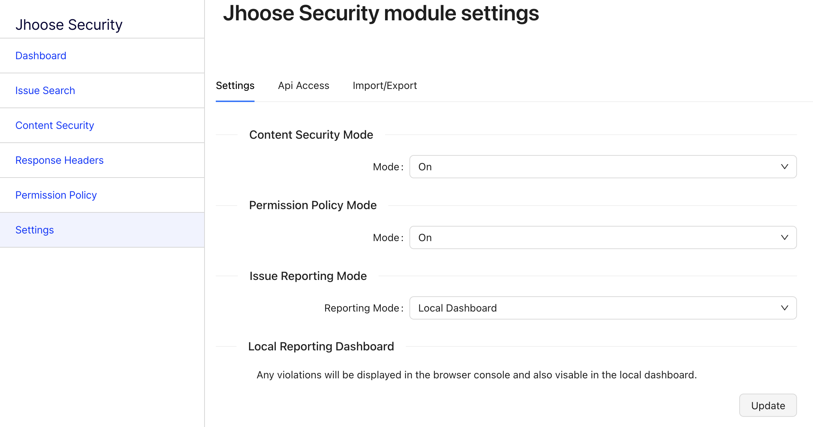
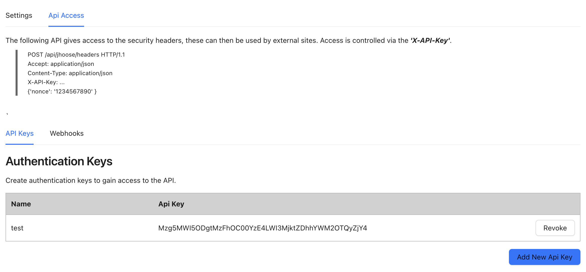
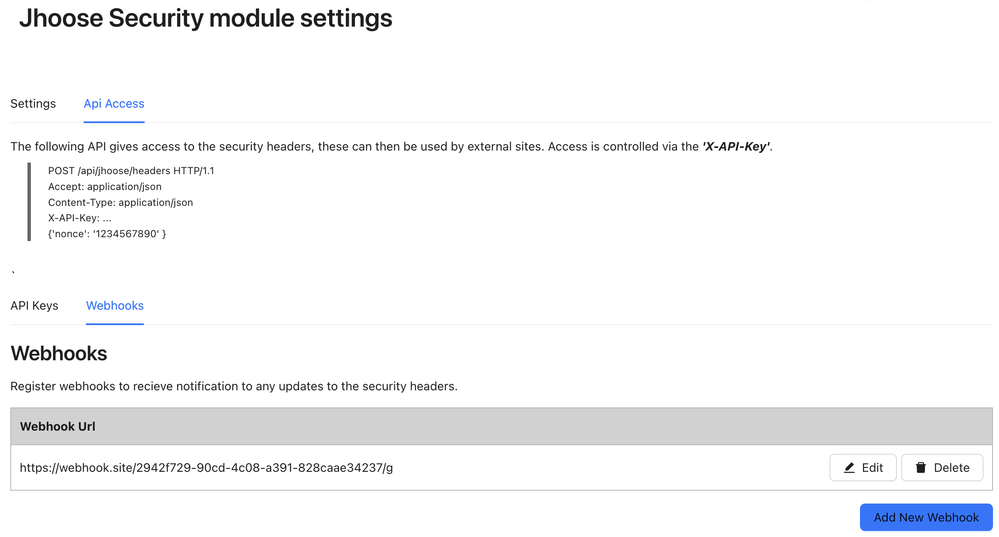
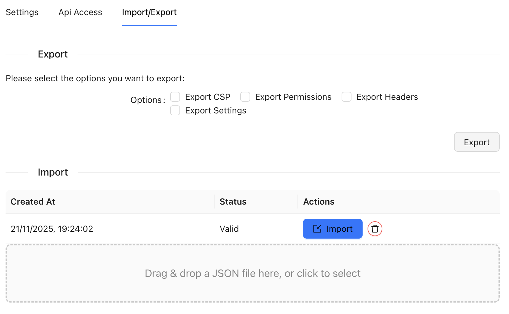
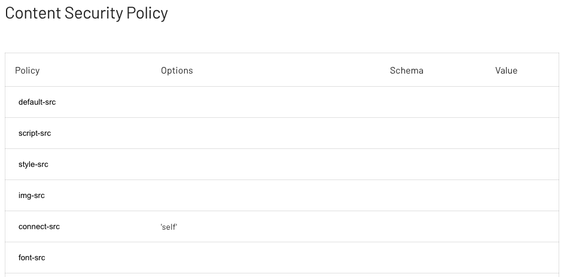
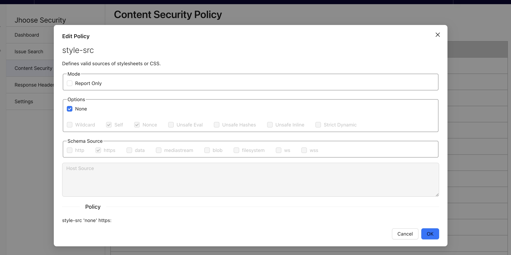
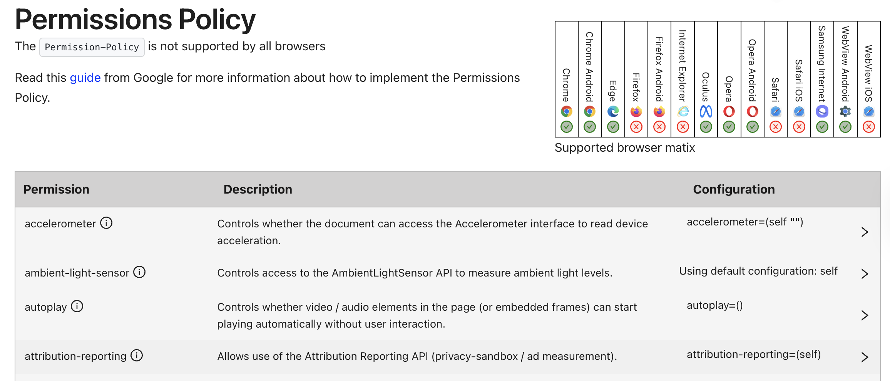
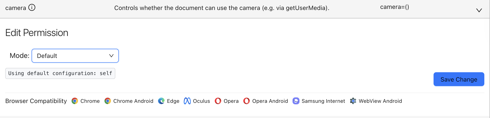
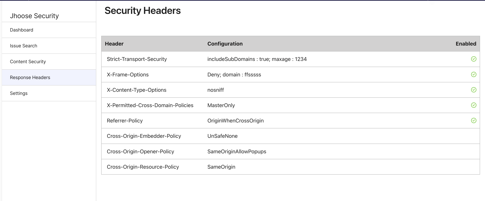
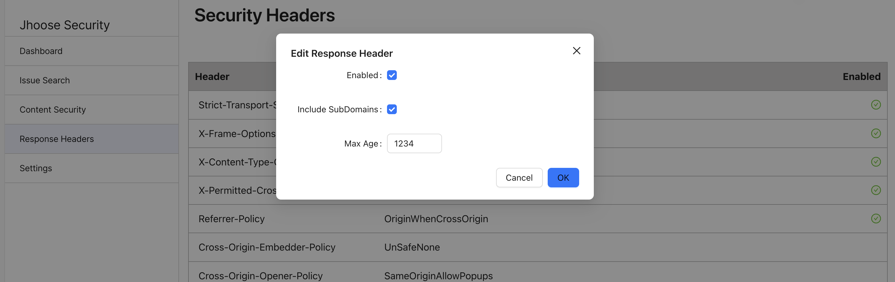

# Admin Interface

## Settings

Settings for the Jhoose Security module.

### Content Security Mode

- **Off** - The `Content-Security-Policy` header will not be created.
- **Report Only** - The `Content-Security-Policy-Report-Only` header will be used for all the configured policies.  Any violations will be reported, but not actioned.
- **On** - The `Content-Security-Policy` header will be created for all the configured policies, unless they are marked as report only in which case the `Content-Security-Policy-Report-Only` header will be used

### Permissions Policy Mode

- **Off** - The `Permissions-Policy` header will not be created.
- **Report Only** - The `Permissions-Policy-Report-Only` header will be used for all the configured policies.  Any violations will be reported, but not actioned.
- **On** - The `Permissions-Policy` header will be created for all the configured policies, unless they are marked as report only in which case the `Permissions-Policy-Report-Only` header will be used

### Issue Reporting Mode
- **None** - Any violations will be reported in the browser.
- **Local Dashboard** - Any violations will be reported in the browser and also recorded locally and will be visible in the local dashboard.
- **External Reportng Tool** - Any violations will be reported in the browser and also sent to the configured endpoint.

## API Access
It is possible to access the security policies via a Rest API.  This is useful if the presentation layer (the head) is seperate to the content.

### API Authentication Keys
Authentication keys are used to gain access to the API.

### Webhooks
You can register webhooks, these will be notified whenever a security policy is modified.

### Import / Export
The import / export feature allows you to backup your security settings, or move the settings between environments.
You can choose the areas you wish to export (CSP, Permissions, Securty headers or general settings)

----

## Content Security Policies
Display all the policies and view a summary of the settings for each one.

When an individual policy is set to read-only an icon will be displayed at the end of the line.

----

### Edit Policy
Dialog box to edit an individual policy.

----

## Permission Policies
Display all the policies and view a summary of the settings for each one.

The configuration column shows the policy’s current settings. If no value is explicitly defined, the default configuration is applied, which means the policy will not be included in the header.

----

### Edit Policy
Expand the panel to allow for the policy to be edited.

#### Mode
- Default - Use the default value for the policy.
- Enabled - The policy is enabled, and you can configure the scope of it's behaviour.
- Enabled (Report Only) - Same as enabled, but any issues will be reported and not blocked.
- Disbled - This mode caused the feature to be disabled in the browser.

#### Scope
- Self - The current site and any domains added to the Allow List
- All  - Any domain.

----

## Security Headers
The recommended security headers can be managed in this screen.

### Edit Header
A dialog box will be displayed allowing you to edit the policy.  If the header isn't required then uncheck the `Enabled` property.

