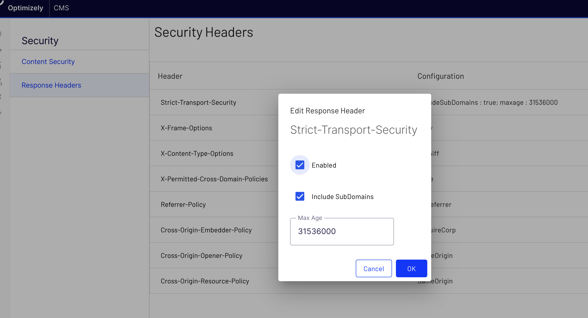

# Admin Interface

## Settings

Settings for the Jhoose Security module.

### Content Security Mode

- **Off** - The `Content-Security-Policy` header will not be created.
- **Report Only** - The `Content-Security-Policy-Report-Only` header will be used for all the configured policies.  Any violations will be reported, but not actioned.
- **On** - The `Content-Security-Policy` header will be created for all the configured policies, unless they are marked as report only in which case the `Content-Security-Policy-Report-Only` header will be used

### Issue Reporting Mode
- **None** - Any violations will be reported in the browser.
- **Local Dashboard** - Any violations will be reported in the browser and also recorded locally and will be visible in the local dashboard.
- **External Reportng Tool** - Any violations will be reported in the browser and also sent to the configured endpoint.

## API Access
It is possible to access the security policies via a Rest API.  This is useful if the presentation layer (the head) is seperate to the content.

### API Authentication Keys
Authentication keys are used to gain access to the API.

### Webhooks
You can register webhooks, these will be notified whenever a security policy is moified.

----

## Content Security Policies
Display all the policies and view a summary of the settings for each one.

When an individual policy is set to read-only an icon will be displayed at the end of the line.

----

### Edit Policy
Dialog box to edit an individual policy.

----

## Security Headers
The recommended security headers can be managed in this screen.

### Edit Header
A dialog box will be displayed allowing you to edit the policy.  If the header isn't required then uncheck the `Enabled` property.

